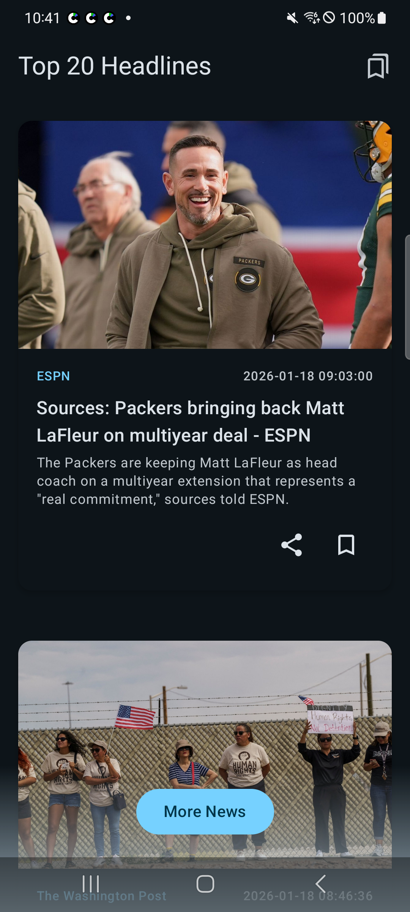
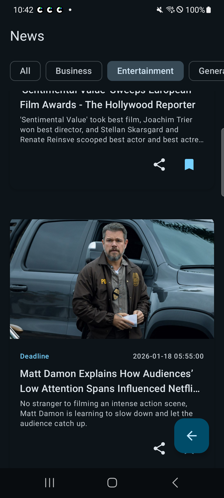

# News HC (News-Reader)

> **클린 아키텍처(Clean Architecture)** 의 의존성 규율을 준수하며,
> **Jetpack Compose** 환경에 최적화된
> **MVI(Model-View-Intent)** 구조를 탐구하고 구현한 소규모 프로젝트입니다.

## 프로젝트의 핵심 목표

이 프로젝트는 기능 구현 보다 아키텍처 설계 단계에서 다음과 같은 고민을 해결하는 데 중점을 두었습니다.

1. **의존성 규칙의 준수**: 도메인 레이어는 최상위 레이어로써 다른 레이어에 의존하지 않도록 설계하여, 다른 레이어의 수정에 영향을 받지 않는 독립적이고 안정적인(
   Stable) 구조를 구축했습니다.
2. **Compose 친화적 MVI**: 리컴포지션 최적화를 위해 상태의 **불변성(Immutability)** 을 엄격히 유지하며, 상태 변경에 따른 트리거(Trigger)
   구성을 통해 선언형 UI에 적합한 효율적인 상태 감지 및 갱신 흐름을 구현했습니다.
3. **데이터 동기화 및 자원 최적화**: 데이터 관찰과 갱신 요청(Fetch) 로직을 분리하고, 관찰 데이터를 **단일 진실 공급원(SSOT)** 으로 관리하여 화면의 목적(
   갱신+관찰 또는 단순 관찰)에 따라 네트워크 리소스 낭비를 줄이고 데이터 정합성을 효율적으로 유지합니다.

## 아키텍처 설계

프로젝트는 **Data - Domain - Presentation**의 전형적인 3계층 구조를 따릅니다.

1. **도메인 레이어**: 유스케이스, 모델, 인터페이스(Repository 등) 순수 코틀린 모듈이며, 각각 독립적인 엔티티로 구성된 것이 특징입니다. 이것이 도메인 레이어의
   안정성을 보장합니다. 인터페이스의 구현체는 **의존성 역전 원칙(DIP)** 을 통해 하위 레이어인 데이터로부터 주입받는 보편적인 방식입니다.
2. **데이터 레이어**: 도메인 레포지토리의 구현체를 가집니다. 데이터베이스, 네트워킹 등의 데이터 전송 및 변환에 대한 책임을 가집니다.
3. **프레젠테이션 레이어**: Jetpack Compose를 통해 UI를 표현하며, **화면 규약(ViewContract)과 ViewModel을 결합한 MVI 패턴**을
   따릅니다. 이는 기존 MVVM에 익숙한 개발자들에게 선호되는 패턴으로 러닝 커브를 낮추고 구조적 마이그레이션 시 유연합니다.

### 아키텍쳐 다이어그램

클린 아키텍쳐의 레이어 간 관계와 MVI 순환 구조와 레이어 간의 관계를 보여줍니다.

[다이어그램 보기](./doc/architecture-diagram.md)

## 주요 설계 고민 및 구현 (MVI)

### 1. ViewContract: 화면 규약의 표준화

화면마다 파편화될 수 있는 State, Event, Effect를 하나의 `Contract` 객체로 묶어 관리합니다. 이를 통해 개발자는 해당 화면의 명세를 한눈에 파악할 수
있습니다.

[화면 규약 가이드](./doc/view-contract-example.md)

### 2. MVIViewModel: 엄격한 상태 관리

`MVIViewModel` 추상 클래스를 통해 상태 업데이트 방식을 규격화했습니다.

* **State**: `StateFlow`를 사용하여 UI에 상태를 노출하며, 오직 내부 `setState`를 통해서만 변경 가능합니다.
* **Event**: 수집된 사용자 의도(Intent)를 규약으로 정의하고, 뷰모델으로 전달합니다.
* **Effect**: `Channel`을 활용해 일회성 이벤트를 보장하며, **단일 소비자 원칙**을 준수합니다.

[뷰모델 가이드](./doc/mvi-view-model.md)

### 3. UI Layer: 관심사의 분리

* **Screen Composable**: 뷰모델과의 의존성을 가지며, 상태 관찰 및 Side-Effect를 처리합니다.
* **Content Composable**: 순수 UI 구성 요소로, `State`를 주입받고 `Event`를 콜백으로 전달합니다. 이는 **Preview 활용도**와 **테스트
  가능성**을 극대화합니다.

[스크린 구현 패턴](./doc/view-contract-example.md#스크린composable-가이드)

### 4. Multi-module: 멀티 모듈 구조

레이어별 물리적 모듈 분리를 통해 의존성 침범을 방지하고 코드 결합도를 낮췄습니다. 변경된 모듈만 재빌드하는 특성을 통해 빌드 시간을 단축하고 독립적인 테스트 환경을 제공합니다.

## 모듈 구조

- `:app`: 어플리케이션 진입점 및 이니셜라이저 관리
- `:presentation`: UI, ViewModel, MVI 패턴 구현
- `:domain`: UseCase, Repository Interface, Entity (순수 Kotlin/Java)
- `:data`: Repository Impl, API, Database
- `:util`: 공통 유틸리티 및 익스텐션

## 기능 목록 (Features)

각 화면은 고유의 화면 규약을 통해 관리됩니다.

- **Top20**: 실시간 인기 뉴스 Top 20 목록을 제공합니다.

[[Contract]](presentation/src/main/kotlin/com/hcpark/news/presentation/top20/contract/Top20Contract.kt)
[[ViewModel]](presentation/src/main/kotlin/com/hcpark/news/presentation/top20/viewmodel/Top20ViewModel.kt)

- **News**: 카테고리별 뉴스 탐색 및 상세 내용을 확인할 수 있습니다.

[[Contract]](presentation/src/main/kotlin/com/hcpark/news/presentation/news/contract/NewsContract.kt)
[[ViewModel]](presentation/src/main/kotlin/com/hcpark/news/presentation/news/viewmodel/NewsViewModel.kt)

- **Bookmarked**: 사용자가 저장한 뉴스를 확인할 수 있습니다.

[[Contract]](presentation/src/main/kotlin/com/hcpark/news/presentation/bookmarked/contract/BookmarkedContract.kt)
[[ViewModel]](presentation/src/main/kotlin/com/hcpark/news/presentation/bookmarked/viewmodel/BookmarkedViewModel.kt)

## 기술 스택

- **Language**: Kotlin
- **UI**: Jetpack Compose
- **Async**: Coroutines, Flow
- **Network**: Ktor
- **Database**: Room
- **DI**: Hilt
- **Architecture**: Clean Architecture + MVI

## 스크린샷
|                    Top 20                     |                    News                     |                        Bookmarked                         |
|:---------------------------------------------:|:-------------------------------------------:|:---------------------------------------------------------:|
|  |  |  |
