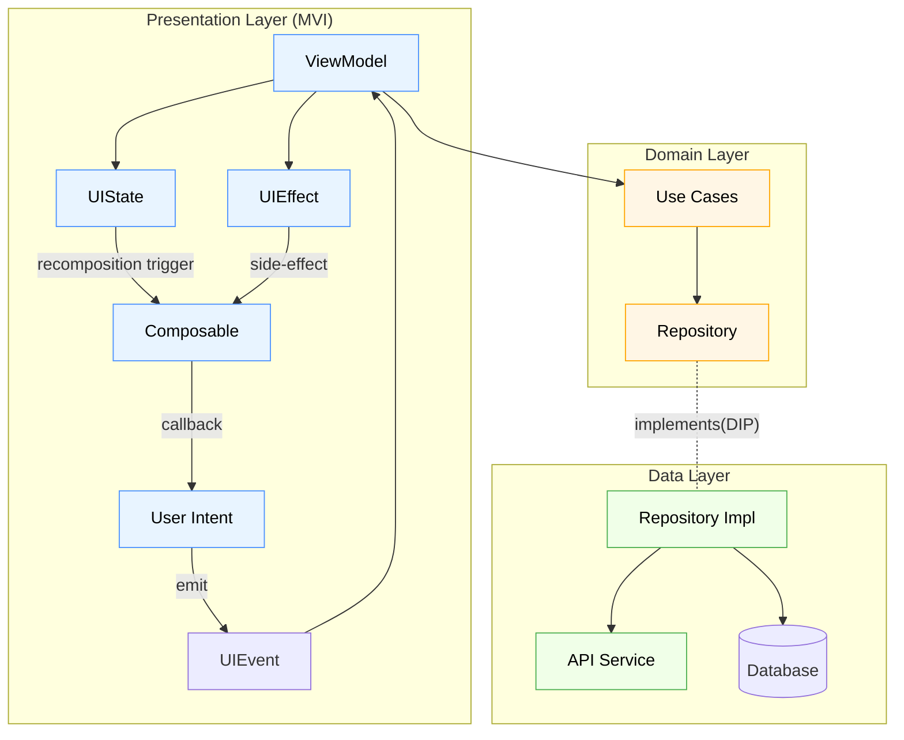

```mermaid
  graph TB
  subgraph "Presentation Layer (MVI)"
  VM[ViewModel]
  UI[Composable]
  INTENT[User Intent]
  STATE[UIState]
  EFFECT[UIEffect]
  EVENT[UIEvent]
  end
  subgraph "Domain Layer"
      UC[Use Cases]
      REPO_IF[Repository]
  end
  subgraph "Data Layer"
      REPO[Repository Impl]
      API[API Service]
      DB[(Database)]
  end

  UI -->|callback| INTENT
  INTENT -->|emit| EVENT
  EVENT --> VM
  VM --> UC
  UC --> REPO_IF
  REPO_IF -.implements(DIP).- REPO
  REPO --> API
  REPO --> DB
  VM --> STATE
  VM --> EFFECT
  STATE -->|recomposition trigger| UI
  EFFECT -->|side-effect| UI


  %% --------------------
  %% 클래스 정의 (배경색)
  %% --------------------
  classDef presentation fill:#E8F4FF,stroke:#4C92FF,stroke-width:1px,color:#000;
  classDef domain fill:#FFF6E5,stroke:#FFA500,stroke-width:1px,color:#000;
  classDef data fill:#F0FFE8,stroke:#4CAF50,stroke-width:1px,color:#000;

  %% --------------------
  %% 클래스 적용
  %% --------------------
  class VM,UI,STATE,EFFECT,INTENT presentation;
  class UC,REPO_IF domain;
  class REPO,API,ROOM data;
```
